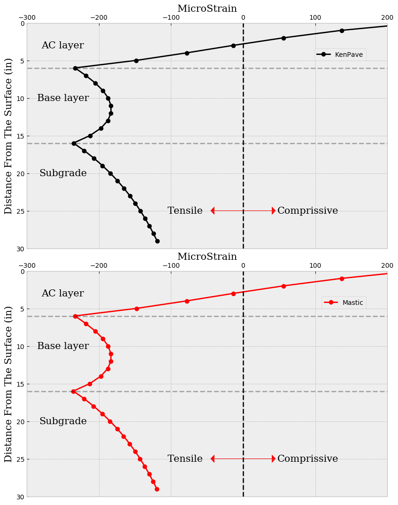
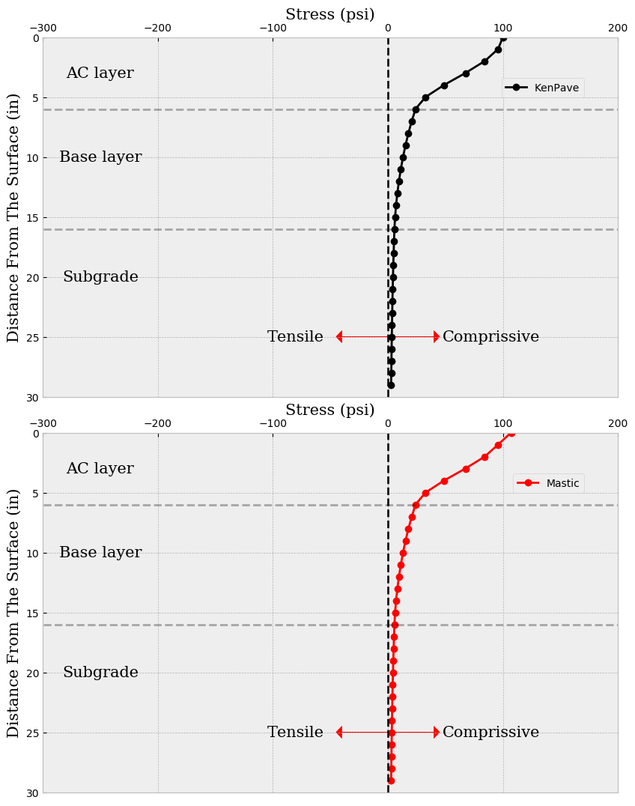
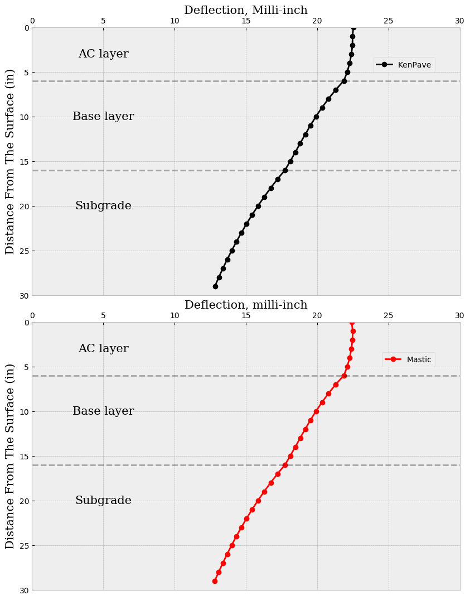

# PyMastic
PyMastic provides elastic response of a pavement system under uniform circular load.This open source program can be used in veriaty of tasks such pavement backcalculation, pavement design, overlay design, etc.PyMastic is written in Python programming language. 

## Validation examples
The PyMastic is compared against several well-esbailished multi-layer elastic programs such as WESLEA and Kenpave. The following images compare the results of Mastic with Kenpave program.

    

    Figure 1. Horizontal Strain Response under circular uniform load (Kenpave VS MASTIC)

    

    Figure 2. Vertical Stress Response under circular uniform load (Kenpave VS MASTIC)

    

    Figure 3. Deflection of the multi layered elastic pavement under circular uniform load (Kenpave VS MASTIC)

## Some extra abilities
PyMastic has the ability to change the matrix inversion method in solving boundry condition to obtain more numerically stable solution. 
The number of iteration for Henkel Intergral to converge is flexible and can be tuned by user. 

## Installation
- Clone the repository
- Run the Test.py

## Requirements
- pip install requriments.

## Sign convention:
- Positive Strain: Compressive
- Positive Stress: Compressive
